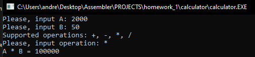
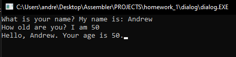
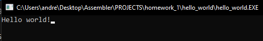
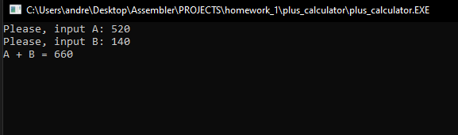
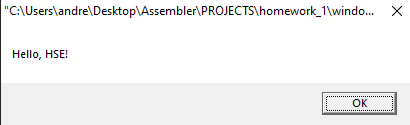

# Домашняя работа №1
</h1>
<h2 style="text-align: right">Романюк Андрей БПИ-194.</h2>
 

Работа состоит из 5-ти небольших программ, написанных самостоятельно.
* calculator - Калькулятор, принимаемый на вход два числа и поддерживаемую операцию.

* dialog - Небольшой диалог с пользователем.

* hello_world - Консольный Hello World

* plus_calcultor - Калькулятор для сложения двух чисел

* window_hello_world - Оконный Hello World

