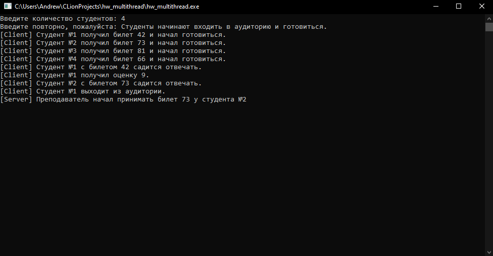
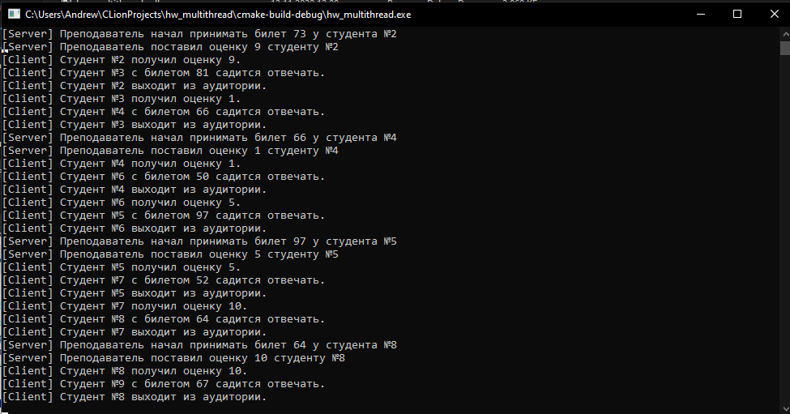
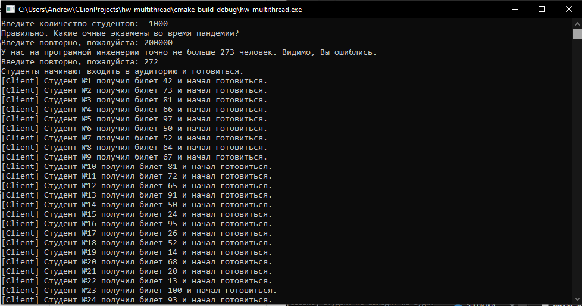

# Задача про экзамен

###  Работу выполнил: студент группы БПИ-194 Романюк А.С
###  Вариант 21.   

## Задача 

Задача про экзамен. Преподаватель проводит экзамен у группы
студентов. Каждый студент заранее знает свой билет и готовит по нему
ответ. Подготовив ответ, он передает его преподавателю. Преподаватель
просматривает ответ и сообщает студенту оценку. Требуется создать
многопоточное приложение, моделирующее действия преподавателя и
студентов. При решении использовать парадигму «клиент-сервер».

## Модель
Клиенты и серверы – способ взаимодействия неравноправных потоков. Клиентский
поток запрашивает сервер и ждет ответа. Серверный поток ожидает запроса от клиента,
затем действует в соответствии с поступившим запросом.

## Решение
Решение представлено в "Поснительная записка.pdf", а также в исходном коде С++ 14 "main.cpp"

## Результаты тестирования

 Рисунок 1 – Результат создания потоков-клиентов.
 Рисунок 2 – Процесс принятия экзамена
 Рисунок 3 – Результат выполнения программы
 Рисунок 4 – Обработка некорректного ввода

## Литература

1. Википедия (2020) «Клиент-сервер» (https://ru.wikipedia.org/wiki/Клиент_—
_сервер). Просмотрено: 10.11.2020
2. Habr (2020) «Клиент-сервер шаг — за — шагом, от однопоточного до
многопоточного (Client-Server step by step)» (https://habr.com/ru/post/330676/).
Просмотрено: 10.11.2020
3. Metanit (2020) «Многопоточное клиент-серверное приложение TCP»
(https://metanit.com/sharp/net/4.3.php). Просмотрено: 10.11.2020
4. Cyberforum (2020) «Простой клиент-сервер с многопоточностью»
(https://www.cyberforum.ru/java-networks/thread1557122.html). Просмотрено:
10.11.2020
5. Docs Microsoft (2020) «Creating Threads» (https://docs.microsoft.com/enus/windows/win32/procthread/creating-threads). Просмотрено: 10.11.2020
6. Shalatov Grost17 «Потоки (threads) в WinAPI»
(http://shatalov.ghost17.ru/winapi/threads.html). Просмотрено: 10.11.2020
7. Легалов А.И.(2020) «Многопоточность. Простая многопоточная программа.
Основные функции» (http://softcraft.ru/edu/comparch/practice/thread/01-simple/).
Просмотрено: 18.10.2020
8. Легалов А.И.(2020) «Многопоточность. Синхронизация потоков. Методы
синхронизации» (http://softcraft.ru/edu/comparch/practice/thread/02-sync/).
Просмотрено: 18.10.2020