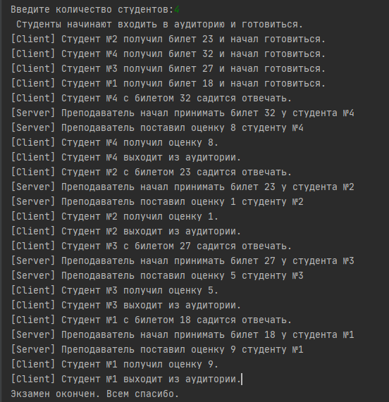
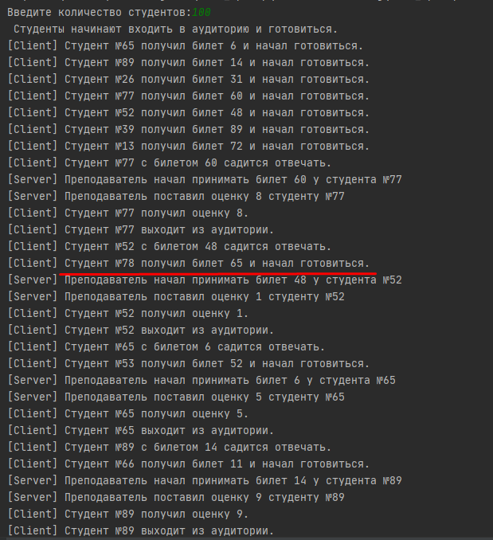
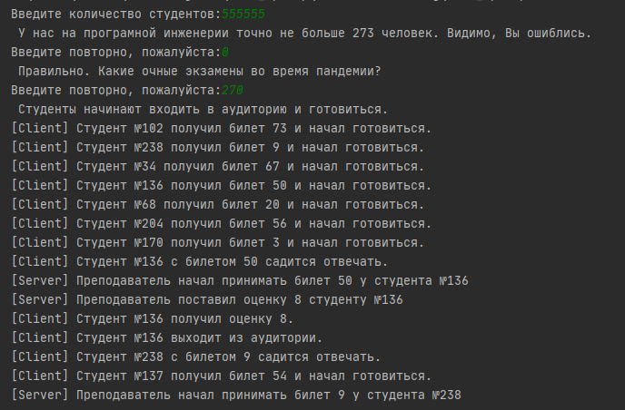

# Задача про экзамен

###  Работу выполнил: студент группы БПИ-194 Романюк А.С
###  Вариант 21.   

## Задача 

Задача про экзамен. Преподаватель проводит экзамен у группы
студентов. Каждый студент заранее знает свой билет и готовит по нему
ответ. Подготовив ответ, он передает его преподавателю. Преподаватель
просматривает ответ и сообщает студенту оценку. Требуется создать
многопоточное приложение, моделирующее действия преподавателя и
студентов. При решении использовать парадигму «клиент-сервер».

Реализовать с помощью библиотеки OpenMP.

## Модель
Клиенты и серверы – способ взаимодействия неравноправных потоков. Клиентский
поток запрашивает сервер и ждет ответа. Серверный поток ожидает запроса от клиента,
затем действует в соответствии с поступившим запросом.

## Решение
Решение представлено в "Поснительная записка.pdf", а также в исходном коде С++ 14 "main.cpp"

## Результаты тестирования

 

Рисунок 1 – Результат создания потоков-клиентов и выполнения программы

 Рисунок 2 – Студент вошёл после того, как аудитория освободилась для него. То есть один из потоков закончил свою работу.

 Рисунок 3 – Результат проверки на некорректный ввод.

## Литература

1.	Википедия (2020) «Клиент-сервер» (https://ru.wikipedia.org/wiki/Клиент_—_сервер). Просмотрено: 10.11.2020
2.	Habr (2020) «Клиент-сервер шаг — за — шагом, от однопоточного до многопоточного (Client-Server step by step)» (https://habr.com/ru/post/330676/). Просмотрено: 10.11.2020
3.	Metanit (2020) «Многопоточное клиент-серверное приложение TCP» (https://metanit.com/sharp/net/4.3.php). Просмотрено: 10.11.2020
4.	Cyberforum (2020) «Простой клиент-сервер с многопоточностью» (https://www.cyberforum.ru/java-networks/thread1557122.html). Просмотрено: 10.11.2020
5.	Docs Microsoft (2020) «Creating Threads» (https://docs.microsoft.com/en-us/windows/win32/procthread/creating-threads). Просмотрено: 10.11.2020
6.	 Shalatov Grost17 «Потоки (threads) в WinAPI» (http://shatalov.ghost17.ru/winapi/threads.html). Просмотрено: 10.11.2020
7.	Легалов А.И.(2020) «Многопоточность. Простая многопоточная программа. Основные функции» (http://softcraft.ru/edu/comparch/practice/thread/01-simple/). Просмотрено: 10.11.2020
8.	Легалов А.И.(2020) «Многопоточность. Синхронизация потоков. Методы синхронизации» (http://softcraft.ru/edu/comparch/practice/thread/02-sync/).  Просмотрено: 10.11.2020
9.	Легалов А.И.(2020) «Многопоточное программирование. OpenMP» (http://www.softcraft.ru/edu/comparch/practice/thread/03-openmp/) Просмотрено 25.11.2020
10.	Pro-Prof.ru (2020) «Учебник по OpenMP» (https://pro-prof.com/archives/4335) Просмотрено 25.11.2020
