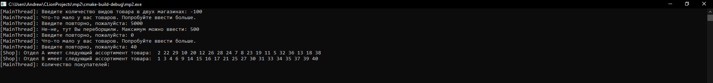
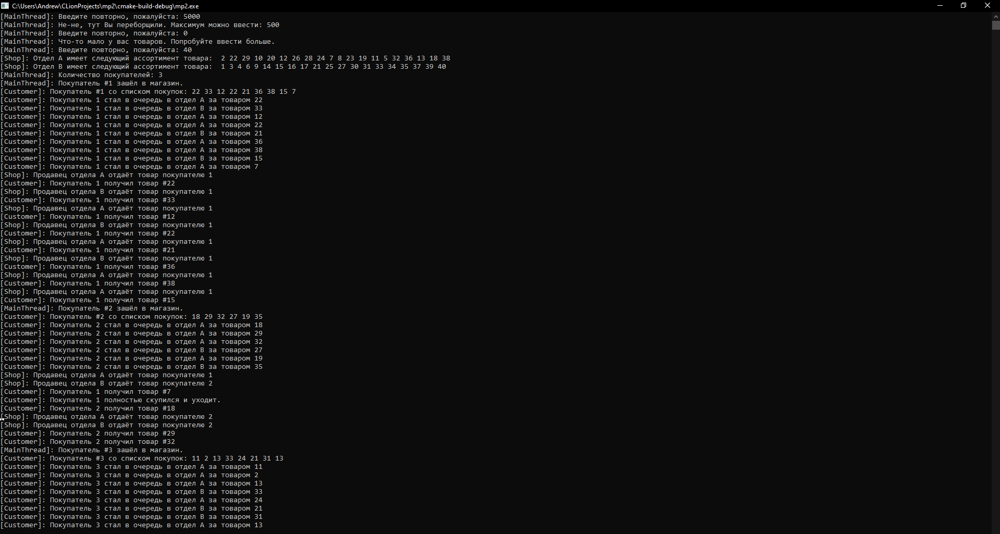
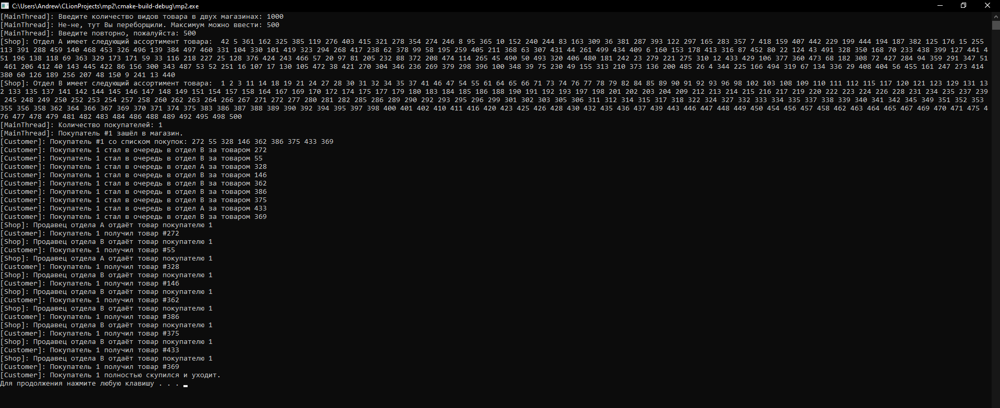
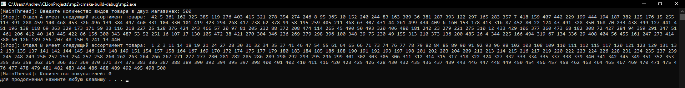

# Задача про "Producer–consumer". Микропроект №2

###  Работу выполнил: студент группы БПИ-194 Романюк А.С
###  Вариант 21.   

## Задача 

В магазине работают два отдела, каждый отдел обладает уникальным ассортиментом. В каждом отделе работает один продавец. В магазин ходят исключительно забывчивые покупатели, поэтому каждый покупатель носит с собой список товаров, которые желает купить. Покупатель приобретает товары точно в том порядке, в каком они записаны в его списке. Продавец может обслужить только одного покупателя за раз. Покупатель, вставший в очередь, засыпает пока не дойдет до продавца. Продавец засыпает, если в его отделе нет покупателей, и просыпается, если появится хотя бы один. Создать многопоточное приложение, моделирующее работу магазина

## Решение
Решение представлено в "Поснительная записка.pdf", а также в исходном коде С++ 14 "main.cpp"

## Результаты тестирования

 
Рисунок 1 – Результат обработки некорректного ввода и работы с пользовательским вводом.

Рисунок 2 – Процесс работы приложения.

Рисунок 3 – Продолжение работы приложения и её завершение.

Рисунок 4 – Результат выполнения приложения.

Рисунок 5 –  Результат ввода 0.

## Литература

1.	Cppreference (2020) «Документация по С++: std::condition_variable::wait» (https://en.cppreference.com/w/cpp/thread/condition_variable/wait). Просмотрено 03.12.2020
2.	Cppreference (2020) «Документация по С++: std::mutex» (https://ru.cppreference.com/w/cpp/thread/mutex). Просмотрено 03.12.2020
3.	Docs Microsoft (2020) «Creating Threads» (https://docs.microsoft.com/en-us/windows/win32/procthread/creating-threads). Просмотрено 03.12.2020
4.	Habr (2020) «Потоки, блокировки и условные переменные в C++11» (https://habr.com/ru/post/182626/). Просмотрено 03.12.2020
5.	Intel (2011) «Шаблон проектирования Producer-Consumer» (https://software.intel.com/content/www/ru/ru/develop/articles/producer-consumer.html). Просмотрено 03.12.2020
6.	Wikipedia (2014) «Producer–consumer problem» (https://en.wikipedia.org/wiki/Producer%E2%80%93consumer_problem). Просмотрено 03.12.2020
7.	Легалов А.И.(2020) «Архитектура параллельных вычислительных систем. Многопоточность » (http://softcraft.ru/edu/comparch/lect/07-parthread/) Просмотрено 03.12.2020
8.	Легалов А.И.(2020) «Многопоточность. Простая многопоточная программа. Основные функции» (http://softcraft.ru/edu/comparch/practice/thread/01-simple/). Просмотрено 03.12.2020
9.	Легалов А.И.(2020) «Многопоточность. Синхронизация потоков. Методы синхронизации» (http://softcraft.ru/edu/comparch/practice/thread/02-sync/).  Просмотрено 03.12.2020

