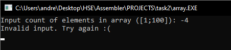

# Домашняя работа №2
</h1>
<h2 style="text-align: right">Романюк Андрей БПИ-194.</h2>
<h2 style="text-align: right">Номер в списке: 21.</h2>
<h2 style="text-align: right">Вариант: 1.</h2>
 

Задача:  
Разработать программу, использующую динамическое выделение памяти под массив, которая вводит одномерный массив A[N], формирует из элементов массива A новый массив B, состоящий только из положительных чисел, и выводит его.

<h3 style="text-align: center">Функционал программы</h3>

> Обработка корректного ввода   

> Настройка левой и правой границы ввода. 

> Выделение места в кучи фиксированного значения N с помощью Heap Alloc  

> Подсчёт количества ввёденных положительных чисел и уведомление пользователя о введёном значении.  

> Печать количества положительных чисел.

> Выделение места под массив B из M (количество положительных чисел) чисел в куче.

> Печать двух массивов по элементно. 

> Обработка исключительного случая  

> Очистка памяти c помощью HeapFree. 

> Весь код программы разделён на подпрограммы. Примеры:     

<h2 style="text-align: center"> Примеры </h2>

 
 
 
 
 
 

